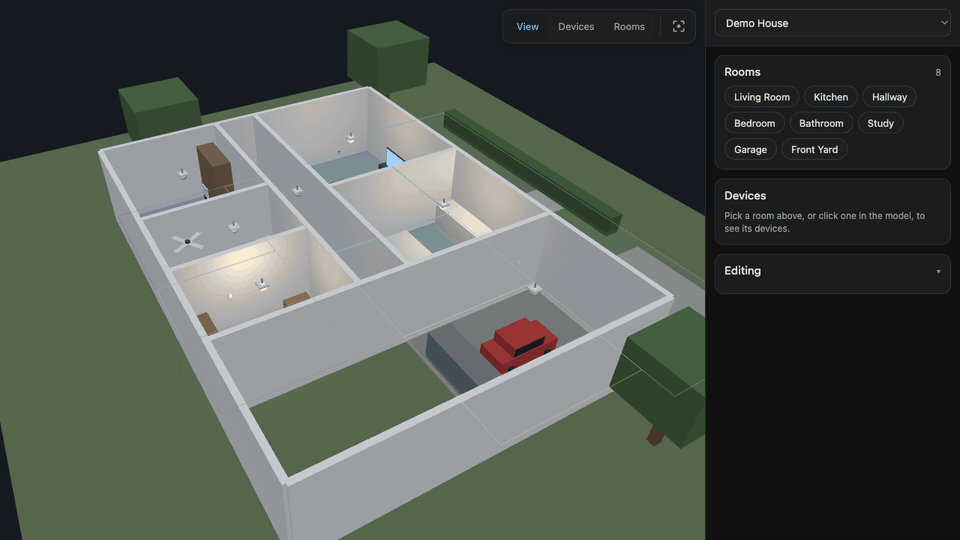

# HASS Digital Twin

A full-screen Home Assistant panel that puts your house in 3D: rooms you can click, devices
that show and take state, and an editor for arranging it all. Built with Lit, Three.js and
TypeScript; the model is any GLB/glTF file.



_The house above is fictional and ships with the repo, so the panel has something to show
before you point it at your own model._

## What it does

- **Rooms.** Each room is an xy polygon on the floor plan, drawn as an overlay and
  hit-tested when you click. Link a room to a Home Assistant area and it inherits that
  area's name and devices — no per-device bookkeeping.
- **Devices.** Anything Home Assistant puts in a linked area shows in the room's list,
  placed in the model or not. Placed devices are drawn from a library of procedural models
  (light, switch, plug, camera, fan, sensor, door, TV, dehumidifier, air purifier, robot
  vacuum, car, phone, laptop, dog) — no per-device modelling needed.
- **Live state.** A light glows, a TV backlights its screen, a fan spins, a contact sensor
  swings its door. Toggle from the list or by clicking the device in the model.
- **Editing in place.** Drag devices across the floor, set their height and rotation, drag
  room corners, add and delete rooms. Saved to Home Assistant, so the layout follows you
  between browsers.
- **Your own house.** One command turns a FreeCAD document into a deployed twin, roof
  excluded so you can see inside.

## Install

```sh
npm install
npm run build
```

Copy `custom_components/hass_digital_twin` into your Home Assistant `config` directory, add
`hass_digital_twin:` to `configuration.yaml`, and restart. You get a **Digital Twin** entry
in the sidebar.

The build writes the panel bundle and copies everything in `public/` into the integration,
so the demo twin works immediately.

## Using the panel

The toolbar over the model has three exclusive modes and a reset-view button:

| Mode        | Click a device      | Drag                           |
| ----------- | ------------------- | ------------------------------ |
| **View**    | controls the device | orbits the camera              |
| **Devices** | selects it          | moves the device it started on |
| **Rooms**   | adds a corner       | moves a room corner            |

In Rooms mode, shift-clicking a corner handle removes it, and the sidebar gains the dropdown
that links the room to a Home Assistant area. Selecting a device opens controls over the
model — toggle, brightness, height, rotation, move, remove.

Edits live in the **Editing** section: **Save layout** stores them in Home Assistant,
**Revert** goes back to the twin's YAML, and **Download mapping YAML** gives you a file you
can commit.

## Twins and mappings

`public/twins.yaml` lists the twins offered in the panel's dropdown; the first is the
default. It is generated from `twins.example.yaml` on first build.

```yaml
twins:
  - id: demo
    name: Demo House
    mapping: /hass_digital_twin/demo.yaml
```

Each mapping names a model, an opening view, its rooms and its devices:

```yaml
model: /hass_digital_twin/house/demo-house.glb
background: "#151b22"
camera: # omit to frame the model automatically
  position: [6.8, 15, 22]
  target: [6.4, 0, 4.6]
areas:
  living_room:
    ha_area_id: living_room # the Home Assistant area this room is
    objects: [area__living_room] # optional: named meshes that also select this room
    polygon: [[0, 0], [5.4, 0], [5.4, 4.6], [0, 4.6]]
    camera: { position: [3.4, 9, 12.6], target: [2.7, 0.5, 2.4] }
entities:
  light.living_room_ceiling:
    type: light # light | switch | camera | control | sensor
    model: light # which procedural model to draw; inferred when omitted
    name: Living Room Ceiling
    area: living_room
    object: light__living_room # a mesh in the model, or a name for the drawn one
    position: [2.7, 2.35, 2.3]
    yaw: 0 # degrees; 0 faces +Z
    light: { position: [2.7, 2.35, 2.3], radius: 5, intensity_scale: 1.3 }
```

A device whose `object` exists in the GLB drives that mesh; otherwise the panel draws the
procedural model at `position`. Rooms work from polygons alone, so a model with no per-room
objects is fine. Coordinates are metres in the model's own space, Y up.

## Publishing your own house from FreeCAD

```sh
npm run publish -- ~/path/House.FCStd --id myhouse --name "My House"
```

That exports a roofless glTF through FreeCAD, publishes it under a content-hashed filename
(so it can be cached forever), seeds room outlines from the document's `Room_*` groups,
builds, and rsyncs the integration to your Home Assistant host. Useful flags:

| Flag                        | Effect                                                           |
| --------------------------- | ---------------------------------------------------------------- |
| `--rooms`                   | regenerate rooms from the document, keeping Home Assistant links |
| `--exclude <regex>`         | objects to leave out (default `^Roof_`)                          |
| `--host`, `--dest`          | where to rsync                                                   |
| `--no-build`, `--no-deploy` | stop early                                                       |

Re-publishing swaps the geometry without disturbing anything you have arranged: a saved
layout owns the room outlines and device placements, the published YAML owns the model.

The export drives the FreeCAD GUI binary with its window hidden, because the glTF exporter
lives in `ImportGui`, which `FreeCADCmd` will not load. It never saves your document.

## Development

```sh
npm run build      # strict TypeScript check, then the production bundle
npm run lint       # ESLint
npm run format     # Prettier
npm run generate:demo-model        # rebuild the demo house
npm run generate:placeholder-model # rebuild the tiny playground model
```

| Path                                   | Contents                                              |
| -------------------------------------- | ----------------------------------------------------- |
| `src/panel/`                           | the panel, its layout and the editor                  |
| `src/renderer/`                        | Three.js scene, picking, device models, room overlays |
| `src/mapping/`                         | mapping schema and loader                             |
| `src/home-assistant/`                  | typed state, registry and service adapters            |
| `custom_components/hass_digital_twin/` | the integration; `frontend/` is generated             |
| `scripts/`                             | model generators and the publish pipeline             |

## Privacy

A mapping for a real house is a floor plan, and often carries its address, so twin mappings
are gitignored by default — `.gitignore` whitelists only the reference twins. Real models go
in `public/models/` (ignored) rather than `public/house/`. Nothing in this repo describes a
real home.
